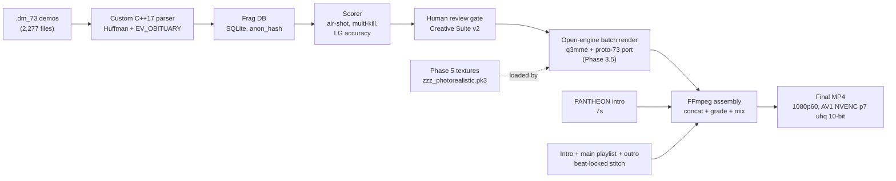

# QUAKE LEGACY

**A ground-up rebuild of the Quake fragmovie toolchain — open-source engine fork, AI graphics overhaul, and a self-driving cinematography pipeline — built from scratch on top of id Tech 3.**

[](https://www.python.org/)
[](https://ffmpeg.org/)
[](#license)
[](https://github.com/id-Software/Quake-III-Arena)


---

## The Mission

Two goals, one codebase:

1. **Graphics overhaul** — run every stock Quake asset (weapons, models, projectiles, maps) through a modern AI graphics pipeline and ship it back to the engine as drop-in `zzz_*.pk3` packs. No engine patches, no config changes, load-order wins alphabetically.
2. **Crack the closed fragmovie toolchain** — study the existing ecosystem with Ghidra, document every binary format and console command, then replace it with an **open-source engine fork** (q3mme + ported protocol-73 support) that we own end-to-end. The result is a movie-making engine where "we know if we change this bit it will make the rail pink."

Everything downstream — AI cinematography, automated fragmovie assembly, photoreal weapon skins — runs on top of those two foundations.

---

## Milestones

```
✅ Graphics pipeline shipped
   → Phase 5 photoreal pk3: 107 weapon/icon/HUD textures, 1024², load-last

✅ Offline MD3 renderer
   → moderngl standalone GL context, 72-frame turntable in <10s, no engine launch

✅ Engine source consolidated
   → 18 id-Tech-3 forks deduped by SHA-256 into one canonical tree (9,895 files / 520 MB)

✅ Protocol-73 port blueprint
   → 18-item checklist + 7 sharp edges, ready to graft onto q3mme (Phase 3.5)

✅ Binary format cracked
   → Custom C++17 dm_73 parser reading Huffman snapshots + EV_OBITUARY frags

🔄 Fragmovie pipeline (Phase 1) — Parts 4/5 v6 rendering now (dual background render)
   → Three-track music structure (intro + main playlist + outro)
   → Beat-sync on transitions, never on clip duration
   → Hard-cut concat, FP-dominant with single FL slow-contrast per frag

⏳ AI cinematography (Phase 3)
   → Gate P3-0 first: human-defined highlight criteria before any auto-extraction

⏳ Open engine fork (Phase 3.5)
   → Port dm_73 / protocol-73 patches into q3mme, retire third-party renderer

⏳ Public CLI (Phase 4)
   → pip install quake-legacy → anyone with demos gets a fragmovie
```

---

## Latest — 2026-04-18

- **Rule P1-R (three-track music)** — every Part ships with `intro + main-playlist + outro`. Per-Part `partNN_intro_music.*` / `partNN_outro_music.*` overrides fall back to series-wide PANTHEON defaults. Main is a **playlist** (`partNN_music_01..NN.mp3`) sized to cover the body runtime without silence gaps. Stitched at render time by `phase1/music_stitcher.py` — beat-locked acrossfade, SHA-256 cache, coverage validator. Music MP3s are gitignored (copyright).
- **Rule P1-S (beat-sync on transitions, not content)** — beat detection nudges the *cut point between clips*, never the clip's duration. Clips ARE the frags; showing 2 s of a 5 s clip to hit a downbeat is invalid.
- **Dual v6 render in flight** — Part 4 + Part 5 re-rendered under the new rules as the fine-tuning baseline. Output: `output/Part4_v6_newrules_2026-04-18.mp4`, `output/Part5_v6_newrules_2026-04-18.mp4`.
- **Encoder tuning report** — [`docs/research/perf-tuning-2026-04-18.md`](docs/research/perf-tuning-2026-04-18.md). Final AV1 NVENC is maxed (`p7 + tune uhq + multipass fullres + spatial-aq + temporal-aq + rc-lookahead 32 + b_ref_mode middle + 10-bit`). Remaining wins are in intermediates (parallel chunk encoding + NVENC normalize).
- **Learnings** — `Vault/learnings.md` L101 (three-track music is the minimum; one track = broken), L102 (beat-sync at seams, not content).

Recent commits: `2cdf3435` perf-tuning report + music reserve · `676d61e0` session 3 doc refresh · `944e6ca6` P1-R/P1-S addendum · `9ec90477` rules + stitcher.

---

## Graphics Overhaul — What's Shipping

### 107-asset photoreal pk3

Real-ESRGAN `4x-UltraSharp` + SD1.5 ControlNet-Tile img2img on every stock weapon, icon, and HUD texture. UV layout preserved (denoise hard-capped at 0.35 — above 0.40 the barrel/stock seams drift). Alpha channels bypass SD entirely. Output mirrors the pak tree exactly, zipped as `zzz_photorealistic.pk3`.

| Weapon | Original (`pak00`, 256²) | Photorealistic (1024²) |
|---|---|---|
| Rocket Launcher |  |  |
| Railgun |  |  |
| Lightning Gun |  |  |
| Plasma Gun |  |  |
| Shotgun |  |  |

Pipeline parameters: [`docs/research/weapon-modding-pipeline-2026.md`](docs/research/weapon-modding-pipeline-2026.md). Per-weapon catalog: [`phase5/weapons/catalog.md`](phase5/weapons/catalog.md). Runnable workflow: [`phase35/comfyui/workflows/weapon_photoreal_v1.json`](phase35/comfyui/workflows/weapon_photoreal_v1.json).

**Roadmap:** Phase 5.2 animated shaders (LG beam, rail trail, muzzle flash) → Phase 5.3 projectiles (rocket, plasma ball, grenade, BFG) → Phase 5.4 alt aesthetics (cel-shaded, cyberpunk, retro-Q1).

### MD3 offline renderer

Headless Python renderer that parses `.md3` directly (header + frames + tags + surfaces + int16 XYZ verts + lat/lng packed normals — pure Python + numpy) and uploads to a moderngl **standalone** OpenGL context — no window, no OSMesa, uses the machine's NVIDIA driver directly. Tweak a texture, hit render, compare. 72-frame 360° turntable renders in under 10 s on an RTX 5060 Ti.


Rim-light fix (before / after):

| Before (`--rim 0.8 --rim-power 2`) | After (`--rim 0.25 --rim-power 4`) |
|---|---|
|  |  |

Features: camera presets (`front · side · iso · fp`), background modes (`black · transparent · map_sky · white · grey · studio`), `--batch` all-cameras render, `--turntable N` PNG sequences, auto-texture discovery walking up from the `.md3` path, anisotropic sampling at 8×.

```bash
python -m tools.md3viewer.render \
  --md3 tools/game-assets/q3a-extracted/models/weapons2/rocketl/rocketl.md3 \
  --output out/rocket_iso.png \
  --camera iso --resolution 1920x1080 --bg grey
```

Companion browser viewer at `tools/md3viewer/web/` (Three.js via importmap CDN, no npm build step) — drag-and-drop textures, live lighting sliders.

---

## Cracking The Engine

### Everything open, nothing proprietary

The goal isn't to ship patches against a closed binary — the goal is to replace that binary with something we compile ourselves. Every third-party tool in the Quake fragmovie ecosystem got the same treatment: disassembled with Ghidra, documented end-to-end, knowledge graph indexed for lookup, and then rebuilt from the id Tech 3 open-source lineage.

| Subject | What we extracted | Destination |
|---|---|---|
| Demo parser binaries | `dm_73` packet framing, Huffman tables, `EV_OBITUARY` event shape, VoIP op-code collision map | Custom C++17 parser (`phase2/dm73parser/`) — static lib + `dm73dump` CLI → JSON Lines |
| Console-command surface | 60+ commands + cvars, `trap_AddAt` disablement, `at <servertime>` substitution pattern | Generated `gamestart.cfg` automation for headless renders |
| Protocol-73 patches | 7 diff files, 18-item port checklist, 7 sharp edges (2D snapshot array, VoIP collision, `maxoffset` Huffman guard, protocol-91 CS reshuffle, `MAX_MSGLEN 49152` stack pressure, `Huff_Init #if 0` silent corruption, `pos.gravity` field presence) | Port target for q3mme (Phase 3.5) |

Full blueprint: [`docs/research/proto73-port-review-2026-04-17.md`](docs/research/proto73-port-review-2026-04-17.md).

### Canonical engine tree

18 id-Tech-3 source forks deduped by SHA-256 into one tree so cross-fork diffs are one `git diff` away instead of buried in separate checkouts. Authority order for conflicting files: `quake3e > q3mme > ioquake3 > quake3-source`. The result is **9,895 source files / 520 MB** at `tools/quake-source/_canonical/`, built reproducibly by `tools/quake-source/build_canonical.py`.

### Knowledge graphs

Five `.c/.h` knowledge graphs built over the consolidated tree — call-site lookup, symbol resolution, cross-fork reference tracing:

| Graph | Nodes | Source lineage |
|---|---|---|
| Quake III Arena | 1,536 | id-Software/Quake-III-Arena |
| ioquake3 | 647 | ioquake3/ioq3 |
| Q3MME (movie maker) | 1,204 | q3mme |
| UberDemoTools (demo parsing) | 1,997 | mightycow/uberdemotools |
| `.dm_73` renderer reference | 1,691 | reverse-engineered for command surface — study only, no code reuse |

### `.dm_73` binary format

Protocol-73 parser reading Huffman-compressed server snapshots, `EV_OBITUARY` extraction with `otherEntityNum`/`otherEntityNum2`/`eventParm` triples (victim / killer / `MOD_*` weapon). Running against a 10-demo sample set, the parser extracts **222 frags** end-to-end with millisecond-accurate `server_time` stamps. Player identities stored as SHA256 `anon_hash` — no handles, no Steam IDs, ever.

```
database/frags.db
  demos         10 rows
  demo_players  67 rows   (anon_hash only — zero PII)
  frags        222 rows   (timestamp, weapon, attacker_hash, victim_hash)
```

Format deep-dive: [`docs/reference/dm73-format-deep-dive.md`](docs/reference/dm73-format-deep-dive.md).

---

## Fragmovie Pipeline (Phase 1)

~3,200 lines of Python driving cut / grade / mix. Currently rendering Parts 4 + 5 v6 as the fine-tuning baseline.

- **Hard-cut concat assembler** via `-f concat` demuxer — bypasses the ~40-input ceiling in ffmpeg's filter-graph allocator. Each clip pre-encodes to a cheap libx264 CRF 20 intermediate, final pass runs grade + bloom + sharpen + music mix as a 1-input graph. No clip cap.
- **Beat-sync planner** — `librosa.onset.onset_detect` per track, cached as `*.beats.json`. Beat timestamps nudge *cut points*; they never truncate clips (Rule P1-S).
- **Three-track music stitcher** — `phase1/music_stitcher.py` produces one continuous audio stream from `intro + main-playlist + outro` with beat-locked acrossfade seams (Rule P1-R).
- **Title card** — PANTHEON logo (7 s, `IntroPart2.mp4`) + "QUAKE TRIBUTE / Part N / By Tr4sH" drawtext block (8 s) prepended to every Part.
- **Three style configurations** — Cinematic / Punchy / Showcase. Current production default is Punchy (FP-backbone, single FL slow-contrast per frag, 1 s head / 2 s tail trim).
- **Final encode** — `av1_nvenc` on Blackwell NVENC gen-9: `p7 + tune uhq + multipass fullres + spatial-aq + temporal-aq + rc-lookahead 32 + b_ref_mode middle + 10-bit p010`. Benchmarked VMAF 96.78 at 20 s per 30 s clip — beats x265 CRF 16 veryslow on both quality and speed.

### Pipeline architecture



---

## Project Splits

- **SPLIT 1 — Video Pipeline Completion** (active). Ship Parts 4-12 as finished fragmovies via the existing Phase 1 pipeline. User checklist: [`SPLIT1_USER_CHECKLIST.md`](SPLIT1_USER_CHECKLIST.md).
- **SPLIT 2 — TR4SH QUAKE** (queued). One engine + one command center + one trainable agent, all fused. Fork of q3mme with protocol-73 patches baked in, embedded FastAPI + SQLite, agent reads the framebuffer so the interface knows what it's seeing before we do. Manifesto: [`docs/superpowers/specs/2026-04-17-tr4sh-quake-manifesto.md`](docs/superpowers/specs/2026-04-17-tr4sh-quake-manifesto.md).

Split 2 starts only after Split 1 closes. No parallel drift.

---

## Creative Suite v2 (Phase 1.5)

A project-local web app at `http://127.0.0.1:8765` that wraps the whole creative loop: annotation → ComfyUI variant generation → MD3 preview → per-pack `zzz_*.pk3` compile → per-clip style switching at render time.

- FastAPI + SQLite WAL + uvicorn (no Docker, no frontend build step)
- Annotation UI (Step 2) **shipped** — pick a Part, scrub video, mark moments with Space / ← → / Shift+← → / M, tag with avi-effect + dream-effect + free tags. JSONL is source of truth; SQLite is a rebuildable mirror. All DOM writes are `createElement + textContent` — zero `innerHTML` from network data.
- Asset browser over the authoritative Steam `pak00.pk3` (QL, 962 MB) + `pak0-8.pk3` (Q3A, 496 MB) — not extracted subsets.
- ComfyUI variant generator with 5 seeded Style Packs: `photoreal`, `pixel_art_16bit`, `cel_shaded`, `retro_quake1`, `q2_sonic_mayhem`.
- AnimateDiff / SVD sprite animator — generate rocket trails, muzzle flashes, explosions, smoke, rail beams.

Gate **ANN-1** (10-annotation stress test on Part 4) pending user. Design spec: [`docs/superpowers/specs/2026-04-17-creative-suite-v2-design.md`](docs/superpowers/specs/2026-04-17-creative-suite-v2-design.md).

---

## Project Status

| Phase | Status | Python LOC | Output |
|---|---|---|---|
| Phase 1 — FFmpeg assembly | **Shipping** | 3,223 | Parts 4-6 Style B rendered; Part 4/5 v6 (P1-R three-track music + P1-S beat-on-seams) in flight |
| Phase 1.5 — Creative Suite v2 | **Step 2 shipped** | — | FastAPI + SQLite at `:8765`; annotation UI live; Gate ANN-1 pending |
| Phase 2 — Demo intelligence | Unblocked pending Gate P3-0 | 1,135 | Custom C++17 parser validated on 10 demos / 222 frags |
| Phase 3 — AI cinematography | Research / awaiting Phase 2 | — | 5 engine knowledge graphs + canonical tree (9,895 files / 520 MB) |
| Phase 3.5 — Proto-73 port (q3mme) | **Blueprint delivered** | — | [`proto73-port-review-2026-04-17.md`](docs/research/proto73-port-review-2026-04-17.md) |
| Phase 4 — Public CLI | Vision | — | `pip install quake-legacy` target |
| Phase 5 — Textures | **Shipped** | 843 | 107-asset `zzz_photorealistic.pk3` |

---

## Quickstart

```bash
# Clone
git clone https://github.com/Stoneface30/quake-legacy
cd quake-legacy

# Python 3.11+ required
python -m venv venv
source venv/Scripts/activate   # Windows (Git Bash)
pip install -r requirements.txt

# FFmpeg 8.1 expected at tools/ffmpeg/ffmpeg.exe

# Phase 1: experiment render for a Part
python phase1/experiment.py --part 3 --style punchy --preview

# Phase 5: install the photorealistic texture pack
cp phase5/04_pk3/zzz_photorealistic.pk3 "$QUAKE_LIVE_BASEQ3"

# MD3 offline render
python -m tools.md3viewer.render --md3 <path>.md3 --camera iso --bg grey \
  --output out/weapon.png --resolution 1920x1080
```

---

## Repository Structure

```
quake-legacy/
  phase1/          FFmpeg assembly pipeline (3,223 LOC)
  phase2/          Custom C++17 dm_73 parser + batch renderer (1,135 LOC)
  phase3/          AI pattern engine + auto cinematics (research)
  phase5/          ComfyUI texture pipeline (843 LOC)
  creative_suite/  FastAPI + SQLite + Three.js web UI
  tools/           FFmpeg 8.1, ghidra, engine tooling, md3viewer
  database/        SQLite schema + anon_hash frag DB
  docs/
    specs/         Design documents (brainstorming outputs)
    reference/     dm_73 format, console-command inventory, ComfyUI pipeline
    research/      Encoder benchmarks, perf tuning, proto-73 port review
    visual-record/ Screenshots and before/after assets (README-safe subset)
```

---

## Technical Reference

Every deep-dive doc in the repo, grouped. The README above is the narrative; these are the sources.

**Architecture & specs**
- [`docs/specs/2026-04-16-quake-legacy-design.md`](docs/specs/2026-04-16-quake-legacy-design.md) — master design (all phases)
- [`docs/specs/highlight-criteria-v1.md`](docs/specs/highlight-criteria-v1.md) — frag highlight rubric (v2 locked in `CLAUDE.md` FT-2)
- [`docs/superpowers/specs/2026-04-17-tr4sh-quake-manifesto.md`](docs/superpowers/specs/2026-04-17-tr4sh-quake-manifesto.md) — Split 2 engine + command center + agent fusion
- [`docs/superpowers/specs/2026-04-17-creative-suite-v2-design.md`](docs/superpowers/specs/2026-04-17-creative-suite-v2-design.md) — Phase 1.5 web UI
- [`docs/superpowers/specs/2026-04-17-command-center-design.md`](docs/superpowers/specs/2026-04-17-command-center-design.md) — merged into Tr4sH Quake manifesto
- [`docs/superpowers/specs/2026-04-17-engine-pivot-design.md`](docs/superpowers/specs/2026-04-17-engine-pivot-design.md) — wolfcam → q3mme migration
- [`docs/INDEX.md`](docs/INDEX.md) — full doc index

**Research & benchmarks**
- [`docs/research/perf-tuning-2026-04-18.md`](docs/research/perf-tuning-2026-04-18.md) — HW audit + encoder wins
- [`docs/research/encoder-recommendation-2026-04-17.md`](docs/research/encoder-recommendation-2026-04-17.md) — VMAF shootout, AV1 NVENC verdict
- [`docs/research/proto73-port-review-2026-04-17.md`](docs/research/proto73-port-review-2026-04-17.md) — 18-item q3mme port checklist + 7 sharp edges
- [`docs/research/phase3-ai-approaches.md`](docs/research/phase3-ai-approaches.md) — AI cinematography research
- [`docs/research/frag-scoring-features.md`](docs/research/frag-scoring-features.md) — scorer feature inventory
- [`docs/research/steam-pak-inventory-2026-04-17.md`](docs/research/steam-pak-inventory-2026-04-17.md) — baseq3 asset source of truth
- [`docs/research/demo-dedup-report-2026-04-17.md`](docs/research/demo-dedup-report-2026-04-17.md) — 2,277-demo corpus dedup

**Binary format & engine dissection**
- [`docs/reference/dm73-format-deep-dive.md`](docs/reference/dm73-format-deep-dive.md) — protocol-73 wire format (1,337 lines)
- [`docs/reference/wolfcam-commands.md`](docs/reference/wolfcam-commands.md) — console-command surface from Ghidra study (no code reuse — reference only)
- [`docs/reference/phase2-kill-query-architecture.md`](docs/reference/phase2-kill-query-architecture.md) — EV_OBITUARY extraction pipeline
- [`docs/reference/quake-asset-sources.md`](docs/reference/quake-asset-sources.md) — Steam paks, pak load order, override rules

**Asset & pipeline catalogs**
- [`docs/reference/comfyui-texture-pipeline.md`](docs/reference/comfyui-texture-pipeline.md) — Real-ESRGAN + ControlNet-Tile recipe
- [`docs/reference/weapon-models-catalog.md`](docs/reference/weapon-models-catalog.md) — per-weapon MD3 + texture inventory
- [`docs/reference/game-asset-catalog.md`](docs/reference/game-asset-catalog.md) — all reskinnable assets
- [`docs/reference/map-catalog.md`](docs/reference/map-catalog.md) — BSP map inventory
- [`docs/reference/effects-catalog.md`](docs/reference/effects-catalog.md) — Phase 1 effect primitives
- [`docs/reference/phase5-bugs-fixed.md`](docs/reference/phase5-bugs-fixed.md) + [`phase5-comfyui-test-results.md`](docs/reference/phase5-comfyui-test-results.md) — texture pipeline debug log

**Reviews & session logs**
- [`docs/reviews/part4-review-2026-04-17.md`](docs/reviews/part4-review-2026-04-17.md) — user review → P1-G/H/K/L overhaul → P1-N..Q new rules
- [`docs/sessions/2026-04-17-wrapup-TOMORROW.md`](docs/sessions/2026-04-17-wrapup-TOMORROW.md) — last wrap-up session log

**Operational**
- [`CLAUDE.md`](CLAUDE.md) — project instructions (hard rules P1-A..S, FT-1..7, engine rules ENG-1..4)
- [`SPLIT1_USER_CHECKLIST.md`](SPLIT1_USER_CHECKLIST.md) — active Split 1 user-action list
- [`HUMAN-QUESTIONS.md`](HUMAN-QUESTIONS.md) — outstanding user decisions
- [`Vault/learnings.md`](Vault/learnings.md) — L-rule ledger (L101 three-track music, L102 beat-on-seams)

---

## Privacy & Safety

This repo is **public and privacy-hard by design.**

- Player names, handles, nicknames, Steam IDs → **never** committed. Ever.
- Demo files (`.dm_73`), renders (`.avi` / `.mp4`), the frag database (`.db`), music files (`.mp3` / `.ogg` / `.wav` / `.flac`), and env files (`.env`) are all gitignored.
- Database schema uses `anon_hash = sha256(raw_name)` in a single `demo_players` mapping table that never leaves local disk.
- All gameplay analysis is statistical — weapon distributions, air-time buckets, kill streaks — never keyed on any identifier that could resolve a human.
- Engine source lineage is all GPL-2.0 (id Software 2005 release). Third-party fragmovie tool binaries were studied with Ghidra for knowledge extraction only; no code copy-paste.

---

## Acknowledgements

The open ecosystem this project stands on.

- [**id Software**](https://github.com/id-Software/Quake-III-Arena) — for open-sourcing id Tech 3 in 2005. Everything here descends from that release.
- [**ioquake3**](https://github.com/ioquake/ioq3) — the maintained id Tech 3 branch that keeps modern systems running the engine.
- [**quake3e**](https://github.com/ec-/Quake3e) — the modern renderer fork used as our canonical-tree authority.
- [**q3mme**](https://github.com/q3mme/q3mme) — Quake 3 Movie Maker's Edition, the target engine for Phase 3.5's protocol-73 port.
- [**UberDemoTools**](https://github.com/mightycow/uberdemotools) — reference implementation for `.dm_73` parsing (validation only; our parser is independent C++17).
- [**Real-ESRGAN**](https://github.com/xinntao/Real-ESRGAN), [**SD1.5**](https://huggingface.co/runwayml/stable-diffusion-v1-5), [**ControlNet-Tile**](https://github.com/lllyasviel/ControlNet) — the open ComfyUI stack powering the graphics overhaul.
- The **Quake Live** community — for twenty years of demos and the sport itself.

---

## License

Distributed under **GPL-2.0** — see [`LICENSE`](./LICENSE). Derives from the GPL id Tech 3 engine lineage (ioquake3, quake3e, q3mme). Every line in this repo is either written from scratch or forked from GPL sources with preserved headers.

**Everything here is open source and homemade.** No proprietary dependencies, no paid middleware, no closed binaries we didn't reverse-engineer ourselves first. The parser, the cinematography engine, the beat-sync, the PANTHEON intros, the Phase 5 texture pipeline, the MD3 renderer, the Creative Suite — all built from scratch or from GPL foundations. This project is a gift back.
