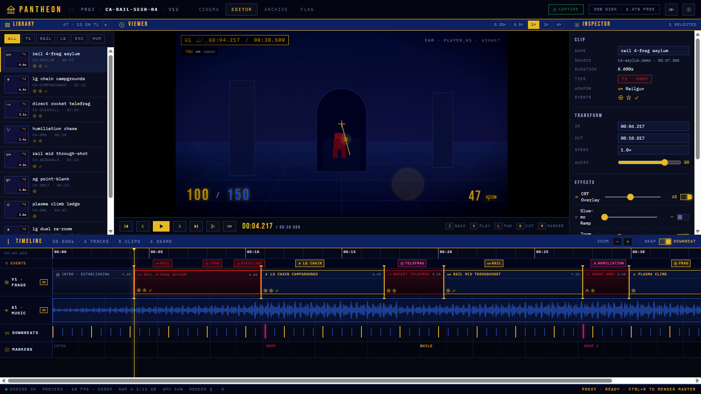
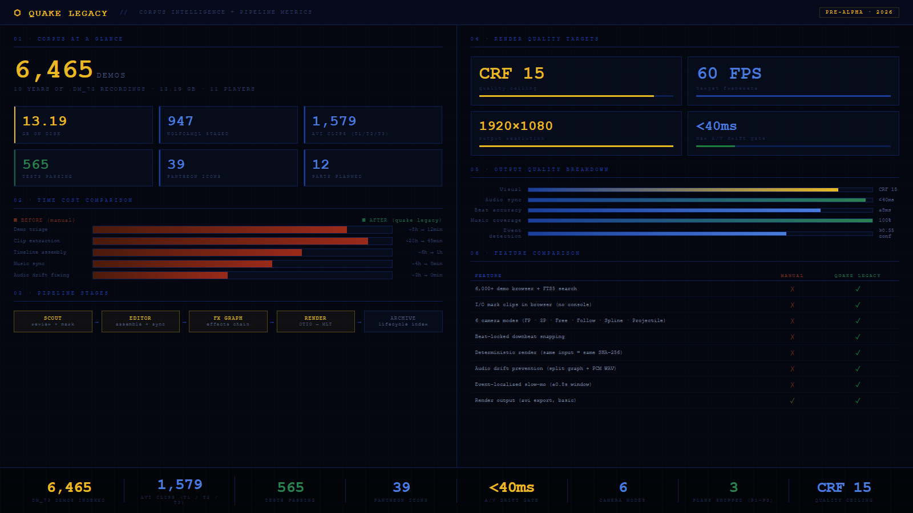
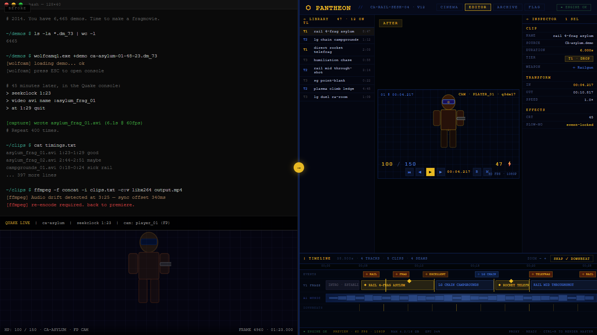
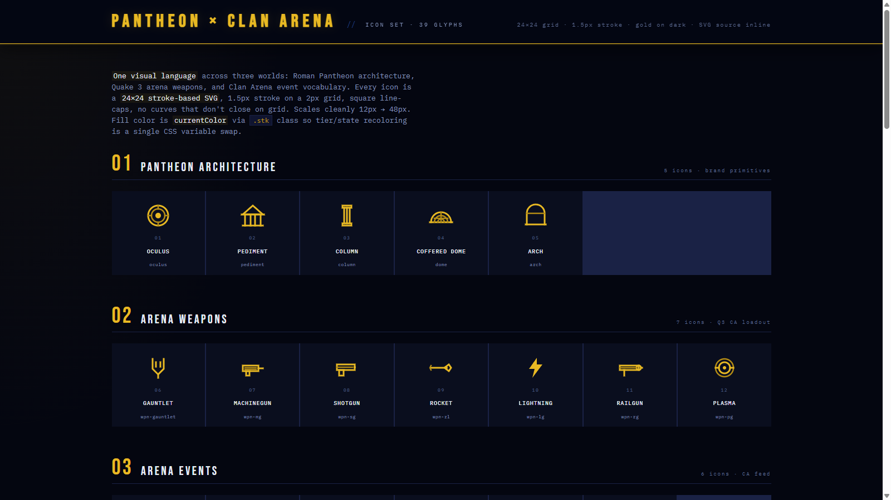

<div align="center">


<br/>

# QUAKE LEGACY

### A Fragmovie Cockpit for the Next Decade of Quake

**An open, unified toolchain that turns 10+ years of `.dm_73` demos into finished Quake fragmovies — a manual-first review surface, an engine-embedded editor, and a deterministic render pipeline, all under one roof.**

[](LICENSE)
[]()
[]()
[]()
[]()

[**Features**](#-what-makes-it-different) · [**Quick Start**](#-quick-start) · [**Architecture**](#-architecture) · [**Roadmap**](#-roadmap) · [**Design System**](#-design-system--pantheon) · [**Contributing**](#-contributing)

</div>

---

<div align="center">



*The PANTHEON Editor v2 — library, viewer, timeline, inspector, music track, event pins, downbeat snap. One keyboard, one store.*

</div>

---

## What it is

Quake Legacy is an opinionated fragmovie production environment built around a single conviction: **the human picks the frag, the machine handles everything else.**

Modern Quake movie-making tools are scattered across a decade of half-abandoned forks — Wolfcam, q3mme, CPMA, libuberdemotools, a dozen timing scripts. Quake Legacy **assimilates them into one engine** and fronts it with a web-based editor that does what OBS + Premiere + your demo player tried to do, without leaving the browser.

You point it at a folder of `.dm_73` files. You review each one in first-person, third-person, free-cam or rocket-cam. You mark the moments worth keeping. You drop them on a timeline. You hit render.

Out comes an MP4 your 2014 self would have spent a weekend on.

---

## ✨ What makes it different

| | Traditional workflow | Quake Legacy |
|---|---|---|
| **Demo review** | Launch engine, type `demo foo`, scrub with console cmds | Browser editor, `J`/`K`/`L` transport, one-click camera switch |
| **Clip extraction** | Manual timestamps in a notepad, re-record with `+stoprecord` | `I` / `O` marks on a live preview, committed to a searchable library |
| **Camera modes** | `cg_thirdPerson 1` and pray | 1P · 3P · Free · Follow · **Projectile-follow** · Wolfcam splines |
| **Demo triage** | Watch each demo twice because you forgot which you'd mined | Lifecycle pill: **fresh → in-review → clean**, filterable in Archive |
| **Timeline** | Offline DAW, audio drift, no event pins | In-browser timeline with event pins, gold seam markers, downbeat snapping |
| **Render** | `/record` + `/video mp4` + prayer | OTIO → MLT (or FFmpeg fallback), deterministic, same input = same hash |
| **Scale** | "I'll edit my 10 best demos someday" | Built for **6,000+ demo libraries**, SQLite FTS5 index, poster-strip thumbs |

---

## 📊 By the numbers

<div align="center">



</div>

| Metric | Value |
|---|---|
| Demo corpus | **6,465** `.dm_73` files · **13.19 GB** |
| AVI clips (T1 / T2 / T3) | **1,579** |
| WolfcamQL staged demos | **947** |
| Test suite | **565** passing |
| Pantheon icon set | **39** glyphs |
| A/V drift gate | **< 40 ms** |
| Render quality ceiling | **CRF 15** · x264 High · 60 fps · 1080p |
| Plans shipped | **3 of 6** (P1 Foundation · P2 Studio UI · P3 Engine Assimilation) |

---

## 🔄 Before / After

<div align="center">



*Left: 45 minutes of Quake console commands per clip, a notepad of timestamps, and a weekend of drift-fixing. Right: mark clips with `I`/`O`, drop on timeline, hit render.*

</div>

---

## 🚀 Quick Start

> **Platform**: Windows / Linux / macOS · **Python** 3.11+ · **Node** 20+ · **C++17** toolchain

```bash
# Clone
git clone https://github.com/Stoneface30/quake-legacy.git
cd quake-legacy

# Install
pip install -r requirements.txt
npm install && node build.js
cmake --build build/parser --config Release    # dm_73 parser (FT-1)

# Point at your demo folder
export QL_DEMO_ROOT=/path/to/your/demos        # Windows: set QL_DEMO_ROOT=G:\demos

# Run
cd creative_suite && uvicorn app:app --port 8765 --reload

# Open
open http://localhost:8765/studio
```

You'll land on the **Cinema** page. Click **Scout** to start mining demos; click **Archive** to browse the library.

**Demos are never committed.** Drop your `.dm_73` files into whatever folder you pointed `QL_DEMO_ROOT` at and they'll be indexed on first boot.

---

## 🧭 The six pages

The `/studio` SPA is a six-page cockpit. One keyboard, one timeline, one store.

| Page | Job | Built on |
|---|---|---|
| **Cinema** | Watch finished movies end-to-end | WebCodecs preview + reel |
| **Scout** | Review raw demos · mark clips · flag demo **clean** | Engine-embedded viewer · J/K/L transport · 6 camera modes · event pin ribbon |
| **Editor** | Assemble flows from clips · music sync · FX | animation-timeline-js · wavesurfer-multitrack · Theatre.js keyframes |
| **FX Graph** | Node-based effect chains (CRT, slow-mo, chroma, duck) | LiteGraph, Pantheon-themed |
| **Archive** | 6,000-demo searchable browser with lifecycle filtering | SQLite FTS5 · 10-frame poster strips · hover-scrub thumbs |
| **Flag** | Music ⇄ flow matching, BPM-to-frag alignment | `music_match.py` with full-length coverage contract |

---

## 🏛️ Architecture

```
┌─────────────────────────────────────────────────────────────────────┐
│                        BROWSER (/studio)                            │
│   Cinema · Scout · Editor · FX · Archive · Flag                     │
│   studio-store.js (observable) ── single source of truth            │
└───────────────────────────┬─────────────────────────────────────────┘
                            │  HTTP (REST) + WS ws://:9731/live
┌───────────────────────────▼─────────────────────────────────────────┐
│                    FASTAPI  (creative_suite/api)                    │
│   /api/studio  · /api/scout  · /api/archive  · /api/forge           │
└───────────────────────────┬─────────────────────────────────────────┘
                            │
     ┌──────────────────────┼──────────────────────────┐
     ▼                      ▼                          ▼
┌──────────┐       ┌────────────────┐         ┌────────────────┐
│  ENGINE  │       │   EXTRACTOR    │         │     RENDER     │
│ ioq3 ++  │──────▶│  dm_73 parser  │────────▶│   OTIO → MLT   │
│  + QL    │  LIVE │  (libuberdt)   │  clips  │  (FFmpeg alt)  │
│  + CPMA  │       │  + Scout UI    │         │                │
│  + wolf  │       └────────────────┘         └────────────────┘
└──────────┘
```

### Live-link — the editor and engine speak in real time

A WebSocket at `ws://localhost:9731/live` carries 25 Hz state frames (position, angles, HP, weapon, ammo) from the engine to the UI, and commands (`seek`, `rate`, `play`, `mark`, `fx`, `cam`, `demo_state`) from the UI back. When you press `3` in Scout to jump to third-person, the engine switches cameras instantly — no replay restart.

### Engine unification — what we take from whom

| Source | Take | Drop | Why |
|---|---|---|---|
| **ioquake3** | Core renderer, cgame, VM, cvars | MP netcode | Cleanest open base |
| **Quake Live** | Weapon stats, physics, dm_73 format | Closed client | Source footage fidelity |
| **CPMA** | Multiview + freecam | CPM movement | Best spectator tools |
| **Wolfcam** | Cam-path splines, demo browser | Its UI chrome | Cinematic camera |
| **q3mme** | Capture pipeline, motion blur, determinism | Its scripting | Why movie-makers still use old Q3 |
| **libuberdemotools** | The entire parser | — | Already solves dm_73 parsing |

Full rationale and license analysis: [`docs/engine/UNIFICATION.md`](docs/engine/UNIFICATION.md).

---

## 🎨 Design System — Pantheon

<div align="center">



*39-glyph SVG sprite. Architecture · Arena weapons · CA events · Status · Editor actions · Media controls · Flow markers.*

</div>

The UI is built on **Pantheon**, a purpose-built design system rooted in the Roman Pantheon's geometry and Quake 3 / Clan Arena's visual heritage.

- **Palette**: ember gold `#e8b923` · deep Pantheon blue `#1a3e9a` · bg `#040610`
- **Type**: Bebas Neue (display) · IBM Plex Mono (data)
- **Icons**: a 39-symbol SVG sprite covering actions, weapons, tiers, events, status, editor, media, flow
- **Components**: CRT scanline overlay, gold seam markers, event pin ribbon, playhead with gold arrowhead

Full system: [`docs/brand/`](docs/brand/) · tokens at [`creative_suite/frontend/css/tokens.css`](creative_suite/frontend/css/tokens.css) · sprite at [`creative_suite/frontend/icons/pantheon.svg`](creative_suite/frontend/icons/pantheon.svg).

---

## 🗺️ Roadmap

The project is structured as six plans, tracked in `docs/plans/`:

- [x] **Plan 1 — Foundation Restructure** · consolidated repo, reference docs, CLAUDE.md ruleset
- [x] **Plan 2 — PANTHEON Studio UI** · 8 REST endpoints, 5 wired panels, observable store, page router
- [x] **Plan 3 — Engine Assimilation** · OTIO bridge, MLT ADOPT, dm_73 C++17 scaffold, FORGE stubs, knowledge graph, Wolfcam ingestion
- [ ] **Plan 4 — Scout & Archive at Scale** · manual extraction UI, 6K-demo search, lifecycle filtering
- [ ] **Plan 5 — Live-Link & Review Cameras** · WS protocol, projectile-follow, Wolfcam path replay
- [ ] **Plan 6 — Ship One Movie End-to-End** · 8-gate acceptance, MLT render, OTIO into DaVinci

See [`docs/plans/`](docs/plans/) for the task-level breakdown.

---

## 🧰 Tech Stack

**Frontend** — vanilla JS + Web Components · WebCodecs · animation-timeline-js · wavesurfer-multitrack · LiteGraph · Tweakpane · Theatre.js · mp4box.js  
**Backend** — FastAPI · SQLite + FTS5 · OpenTimelineIO · MLT framework (via conda-forge)  
**Engine** — C / C++17 · ioquake3-derived · CMake · libuberdemotools (vendored)  
**Render** — MLT · FFmpeg fallback · deterministic output (same input → same SHA-256)

---

## 🗂️ Repo layout

```
creative_suite/              The whole web app
  api/                       FastAPI routers (studio · scout · archive · forge)
  frontend/                  /studio SPA — Pantheon-themed cockpit
    css/tokens.css           Design tokens (copy-verbatim, do not rename)
    icons/                   39-symbol SVG sprite
  engine/                    Render pipeline (ffmpeg assembly, beat sync)
  database/                  MusicLibrary.json, frags.db

engine/                      Native engine sources + RE + parser
  engines/                   ioquake3 · wolfcamql · q3mme · cpma (SHA-256 deduped)
  wolfcam/                   Wolfcam binary + demo staging + CS-5 guard
  parser/                    dm_73 C++17 parser (libuberdemotools wrapper)

docs/
  brand/                     Pantheon design system · mark SVG · icon set
  screenshots/               README imagery (editor cockpit · stats · before/after)
  engine/                    Integration spec · unification · live-link protocol
  plans/                     Phase plans P1–P6 with task IDs
  decisions/                 ADRs (mlt-vs-ffmpeg, theatre-licensing, etc.)

demos/                       .dm_73 files — NOT committed (gitignored)
output/                      Renders — NOT committed
```

---

## 🔐 What is and isn't committed

**Committed**: all source, design tokens, logos, docs, fixtures, test harnesses, the 39-icon sprite.

**Never committed**:
- `.dm_73` · `.avi` · `.mp4` files (licensing + size)
- Player names, Steam IDs, in-game chat lines
- Map `.pk3` files
- Anything under `demos/`, `output/`, `QUAKE VIDEO/`, `wolfcam/demos/`

A pre-commit hook enforces this; see [`tools/git/pre-commit`](tools/git/pre-commit).

---

## 🤝 Contributing

Quake Legacy is pre-alpha — the architecture is still hardening. If you'd like to help:

1. Read [`docs/engine/INTEGRATION.md`](docs/engine/INTEGRATION.md) — it's the single source of truth for how pieces fit together
2. Read [`CLAUDE.md`](CLAUDE.md) — the P1-/CS-/UI-/ENG- rules govern every PR
3. Pick a **Wave A / B / C** ticket from [`docs/plans/`](docs/plans/)
4. Open a draft PR early; pixel-diff against `docs/claude_designer/Pantheon Editor v2.html` before asking for review

**Non-negotiable rules** (Engine Spec §02):
- Never rename a `--p-*` design token
- Never inline a `<svg>` — always use the sprite via `<Icon name="…"/>`
- Never "improve" the `.app` grid — children become components, grid stays
- Fonts: Bebas Neue + IBM Plex Mono only
- CRT overlay, gold seams, event pins, playhead arrow are P0 — never deferred

---

## 📜 License

**GPL-2.0** — inherited from ioquake3 + q3mme + Wolfcam lineage.

Vendored `libuberdemotools` is permissive (see its `LICENSE`). The Pantheon design system (logos, icon sprite, tokens, HTML artifacts under `docs/brand/`) is released under **CC BY 4.0** so the visual identity can be referenced independently of the GPL code.

**Not affiliated with id Software, ZeniMax, or the Quake Live team.** "Quake" is a trademark of their respective owners. This project uses only the open engine lineage (ioq3 + derivatives) and the `.dm_73` demo format, which we treat as a file format spec.

---

## 🙏 Acknowledgements

Standing on the shoulders of a decade of Quake movie-making:

- **ioquake3 team** — the open base that made everything else possible
- **q3mme / Moviemaker's Edition** — the capture pipeline standard
- **Wolfcam / WolfcamQL** — cinematic demo playback, solved
- **CPMA team** — multiview and freecam done right
- **libuberdemotools** — demo parsing as a solved problem
- **OpenTimelineIO · MLT** — modern interchange + render infra
- Every frag movie that ever used a train whistle for a cut

---

<div align="center">

**Quake Legacy** — built for the scene that refused to stop recording.

<sub>⚡  Pre-alpha · Breaking changes expected · Star and watch for Wave A drop</sub>

</div>
