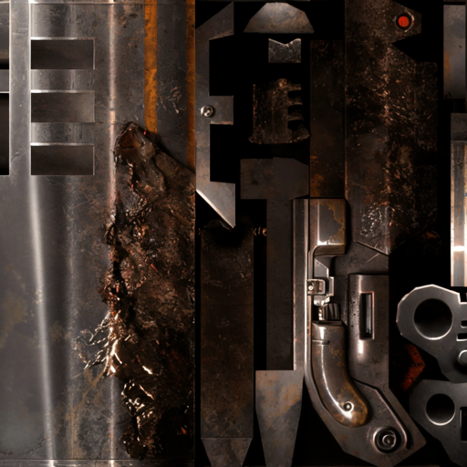
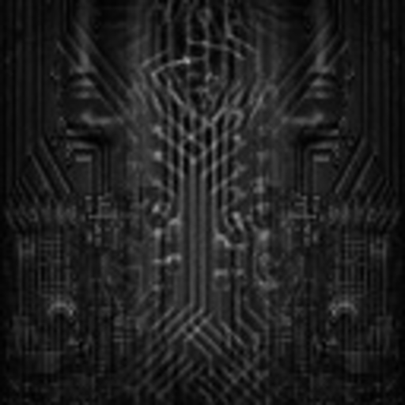
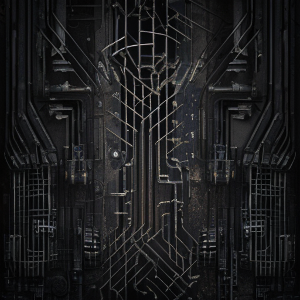
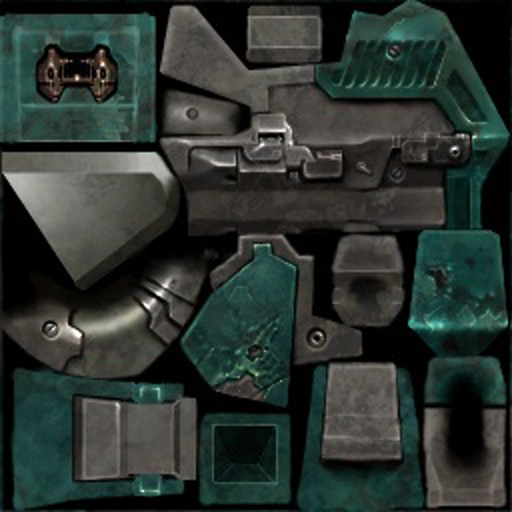
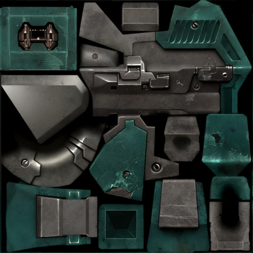
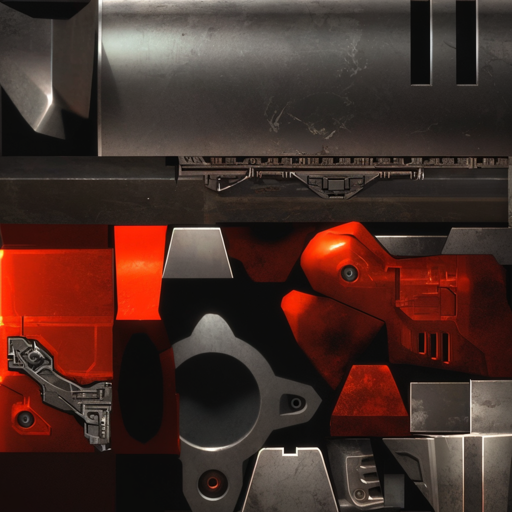
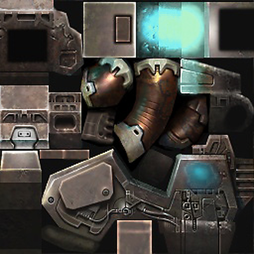
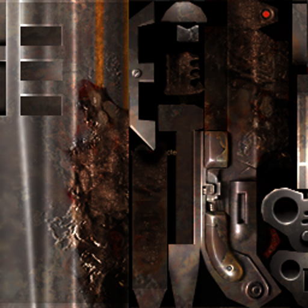
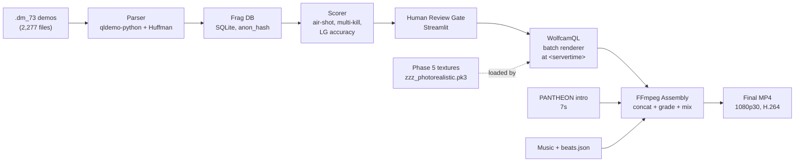

# QUAKE LEGACY

**An AI-powered fragmovie production pipeline for Quake Live: 10+ years of `.dm_73` demos → finished fragmovies, automated from parse to final cut.**

[](https://www.python.org/)
[](https://ffmpeg.org/)
[](#license)
[](https://github.com/id-Software/Quake-III-Arena)



---

## The Problem

A decade of competitive Quake Live Clan Arena play sits on disk as **2,277 `.dm_73` demo files** — hundreds of hours of footage, tens of thousands of kills, no index, no scrubbing, no tool in the world that can find a 4-kill air-rocket combo without a human watching every second.

Traditional fragmovie production for that corpus would take years of manual review. This project turns it into a pipeline: parse the demos as binary, score every kill, batch-render the winners through WolfcamQL, and assemble through FFmpeg with beat-synced music. Human approves at each gate. Machine does the rest.

---

## What's Cracked So Far

Concrete state of the project today, not vaporware.

### `.dm_73` binary format
Protocol-73 parser reading Huffman-compressed server snapshots, `EV_OBITUARY` extraction with `otherEntityNum`/`otherEntityNum2`/`eventParm` triples (victim / killer / MOD_* weapon). Running against a 10-demo sample set, the parser extracts **222 frags** end-to-end with millisecond-accurate `server_time` stamps. Player identities are stored as SHA256 `anon_hash` — no handles, no Steam IDs, ever.

```
database/frags.db
  demos         10 rows
  demo_players  67 rows   (anon_hash only — zero PII)
  frags        222 rows   (timestamp, weapon, attacker_hash, victim_hash)
```

### WolfcamQL command inventory
60+ console commands and cvars catalogued from `wolfcam_consolecmds.c`. Critical finding for Phase 2 automation: **`trap_AddAt` is disabled in the shipped WolfcamQL build**, forcing the pipeline to the `at <servertime> <command>` replacement pattern. Recording windows calibrated to **8s pre-roll / 5s post-roll** around the frag event (initial 3s/2s was too tight — see `projects/*/memory/feedback_phase2_recording_windows.md` for the derivation).

### Engine source knowledge graphs
Five knowledge graphs built from the C sources of the Quake tooling ecosystem, indexed for fast cross-repo lookup:

| Graph | Nodes | Source |
|---|---|---|
| wolfcam / cgame | 1,691 | brugal/wolfcamql |
| UberDemoTools | 1,997 | mightycow/uberdemotools |
| Quake III Arena | 1,536 | id-Software/Quake-III-Arena |
| Q3MME | 1,204 | q3mme |
| ioquake3 | 647 | ioquake3/ioq3 |

### Phase 1 — FFmpeg assembly pipeline
~3,200 lines of Python driving the cut/grade/mix pipeline. Features shipping today:
- **Hard-cut concat assembler** with game-audio preserved at 55% under music (no xfade chain — clean cuts only, learned the hard way in Part 4 v1)
- **Beat-sync planner** (librosa onset detection, cached per track as `*.beats.json`)
- **PANTHEON intro prepend**: first 7s of `IntroPart2.mp4` on every Part
- **Three locked styles**: Cinematic (slower, dramatic grade), Punchy (FP-first hard cuts), Showcase (FL establishing shots earn their screen time)
- **10 beat-gridded music tracks** downloaded + analyzed for Parts 3-12

### Phase 5 — Photorealistic texture pipeline
107-asset `.pk3` produced by running the full `pak00.pk3` weapon/icon/UI tree through ComfyUI with 4x-UltraSharp + ControlNet Tile. Alpha channel preserved for masked shaders. Path tree mirrored exactly so it drops into `baseq3/` as `zzz_photorealistic.pk3` — load order guaranteed last, no config changes required.

```
phase5/04_pk3/zzz_photorealistic.pk3   30 MB, 107 assets
```

### Demo audio analysis
Game-audio mix locked at 45-55% under music. Grenade/rocket impacts **out of POV** flagged as automatic follow-cam candidates for Phase 2 re-render — the user never saw the hit but heard it, which means the camera should.

---

## Texture Showcase — pak00 vs Phase 5

All pairs below: left is the original Quake Live `pak00.pk3` texture, right is the Phase 5 output. Both resized to 512px wide for GitHub rendering; the shipping `.pk3` keeps the native 4x resolution.

| Weapon | Original (pak00) | Photorealistic (Phase 5) |
|---|---|---|
| Railgun |  |  |
| Lightning Gun |  |  |
| Rocket Launcher |  |  |
| Plasma Gun |  |  |
| Shotgun |  |  |

Pipeline details in [`docs/reference/comfyui-texture-pipeline.md`](docs/reference/comfyui-texture-pipeline.md). Test results + bug tracker: [`docs/reference/phase5-comfyui-test-results.md`](docs/reference/phase5-comfyui-test-results.md).

---

## Pipeline Architecture



---

## Render Samples

Part 3 full-length previews, **307 seconds each at 1920x1080 H.264**, produced by three locked style configurations running the same clip list. Source MP4s live on the producer's disk — they are not committed (approximately 900 MB each, and any in-game HUD frame can contain other players' handles, which would violate the privacy rule of this repo).

| Part 3 style | Duration | Size | Character |
|---|---|---|---|
| **A — Cinematic** | 5:07 | 874 MB | Slow grade, long FL establishing shots, music in front |
| **B — Punchy** | 5:07 | 1,037 MB | FP-first, hard cuts, game audio forward, FL earned |
| **C — Showcase** | 5:07 | 909 MB | Balanced — T1 frags get showcase framing, T3 as filler |

Part 4 final (v4) incorporates the Gate-1 review fixes: PANTHEON intro prepended, music track locked, game-audio re-floored at 55% under music, hard-cut concat (no xfade chain), and all-angles clip selection replacing the v1 single-angle mistake.

---

## Project Status

| Phase | Status | Python LOC | Output |
|---|---|---|---|
| Phase 1 — FFmpeg assembly | **Shipping** | 3,223 | Parts 3-4 rendered, styles locked |
| Phase 2 — Demo intelligence | Unblocked pending Gate P3-0 | 1,135 | Parser validated on 10 demos / 222 frags |
| Phase 3 — AI cinematography | Research / awaiting Phase 2 | — | 5 knowledge graphs built |
| Phase 4 — Public CLI | Vision | — | `pip install quake-legacy` target |
| Phase 5 — Textures | **Shipped** | 843 | 107-asset `zzz_photorealistic.pk3` |

---

## Quickstart

```bash
# Clone
git clone https://github.com/Stoneface30/quake-legacy
cd quake-legacy

# Python 3.11+ required
python -m venv venv
source venv/Scripts/activate   # Windows (Git Bash)
pip install -r requirements.txt

# FFmpeg 8.1 expected at tools/ffmpeg/ffmpeg.exe
# (the pipeline invokes this path directly)

# Phase 1: experiment render for a Part
python phase1/experiment.py --part 3 --style punchy --preview

# Phase 5: install the photorealistic texture pack
cp phase5/04_pk3/zzz_photorealistic.pk3 "$QUAKE_LIVE_BASEQ3"
```

---

## How It Works (deeper)

**Demo parsing.** Quake Live protocol-73 demos are Huffman-compressed server-to-client message streams. The parser uses `qldemo-python` for the outer packet framing and an in-tree Huffman implementation for the compressed payload. Every snapshot holds a delta-compressed entity state array; the parser walks entities looking for `event & ~0x300 == EV_OBITUARY` (the top 2 bits toggle each time the event re-fires, so they must be masked). See [`docs/reference/dm73-format-deep-dive.md`](docs/reference/dm73-format-deep-dive.md) for the full walk-through.

**WolfcamQL automation.** Because `trap_AddAt` is disabled in the WolfcamQL build, every scripted action goes through a generated `gamestart.cfg`:

```
seekclock 8:52
video avi name demo_name
at 9:05 quit
```

The binary is launched headless with `+set fs_homepath <out_dir> +exec gamestart.cfg +demo <path>` and drops the AVI in a known location. With 8s pre-roll and 5s post-roll per frag, the recording window is tight enough to batch thousands of clips overnight.

**FFmpeg assembly.** Hard-cut concat, not xfade. Game audio and music mixed via `amix` at `inputs=2:weights=0.55 1.0`, because muting the game audio destroys the sport (Part 4 v1 learned this — grenade direct hits, rocket impacts and rail cracks are the texture). Transitions default to a 0.08s xfade which reads as a flash-cut; real 0.25s+ xfades are reserved for major section breaks.

**Beat sync.** Each music track gets `librosa.onset.onset_detect` run once at ingestion time and cached as `<track>.beats.json`. The clip planner snaps clip boundaries to the nearest beat within a tolerance window, which gives cuts a musical feel without the edit feeling metronomic.

---

## Phase Roadmap

| Phase | Goal | Key gate |
|---|---|---|
| **1. FFmpeg assembly** | Render Parts 3-12 using existing sorted AVIs | User review per Part (P1-2, P1-3) |
| **2. Demo intelligence** | Parse 2,277 demos, score every kill, batch-render approved clips through WolfcamQL | Gate P3-0 — define highlight criteria with human first |
| **3. AI cinematography** | Auto-select camera angles per map, bullet-cam, slow-mo triggers from entity trajectories | Blocked on Phase 2 data |
| **4. Public CLI** | `pip install quake-legacy` — anyone with demos can get a fragmovie | Post-Phase-3 polish |
| **5. Textures** | Photorealistic pk3 drop-in for Quake Live | **Shipped** — 107 assets |
| **6. Maps** | Future — photogrammetry/AI retexture for CA map pool | Vision |

---

## Repository Structure

```
quake-legacy/
  phase1/          FFmpeg assembly pipeline (3,223 LOC)
  phase2/          Demo parser + WolfcamQL batch renderer (1,135 LOC)
  phase3/          AI pattern engine + auto cinematics (research)
  phase5/          ComfyUI texture pipeline (843 LOC)
  tools/           FFmpeg 8.1, WolfcamQL, UberDemoTools, Ghidra targets
  database/        SQLite schema + anon_hash frag DB
  wolfcam-configs/ Per-map camera splines + recording presets
  docs/
    specs/         Design documents
    reference/     WolfcamQL commands, dm_73 format, ComfyUI pipeline
    visual-record/ Screenshots and before/after assets (README included)
```

---

## Privacy & Safety

This repo is **public and privacy-hard by design.**

- Player names, handles, nicknames, Steam IDs → **never** committed. Ever.
- Demo files (`.dm_73`), renders (`.avi`/`.mp4`), the frag database (`.db`), and env files (`.env`) are all gitignored.
- Database schema uses `anon_hash = sha256(raw_name)` in a single `demo_players` mapping table that never leaves local disk.
- All gameplay analysis is statistical — weapon distributions, air-time buckets, kill streaks — never keyed on any identifier that could resolve a human.

---

## Acknowledgements

This project stands on the shoulders of an open ecosystem.

- [**WolfcamQL**](https://github.com/brugal/wolfcamql) (GPL) — the headless renderer that makes batch demo rendering possible
- [**ioquake3**](https://github.com/ioquake/ioq3) — the id Tech 3 engine branch that keeps everything running
- [**UberDemoTools**](https://github.com/mightycow/uberdemotools) — reference implementation for dm_73 parsing
- [**Q3MME**](https://github.com/q3mme/q3mme) — camera pathing and movie-making inspiration
- [**id Software**](https://github.com/id-Software/Quake-III-Arena) — for open-sourcing id Tech 3 in 2005
- The **Quake Live** community — for twenty years of demos and the sport itself

---

## License

This project derives from GPL-licensed sources (WolfcamQL, ioquake3, UberDemoTools) and is therefore itself distributed under **GPL**. A `LICENSE` file will be added alongside the first tagged release.

The Quake III Arena engine has been [open source since 2005](https://github.com/id-Software/Quake-III-Arena). This project is a gift back.
