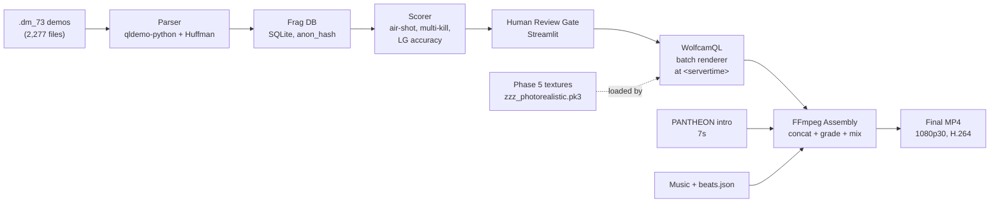

# QUAKE LEGACY

**An AI-powered fragmovie production pipeline for Quake Live: 10+ years of `.dm_73` demos → finished fragmovies, automated from parse to final cut.**

[](https://www.python.org/)
[](https://ffmpeg.org/)
[](#license)
[](https://github.com/id-Software/Quake-III-Arena)


---

## The Problem

A decade of competitive Quake Live Clan Arena play sits on disk as **2,277 `.dm_73` demo files** — hundreds of hours of footage, tens of thousands of kills, no index, no scrubbing, no tool in the world that can find a 4-kill air-rocket combo without a human watching every second.

Traditional fragmovie production for that corpus would take years of manual review. This project turns it into a pipeline: parse the demos as binary, score every kill, batch-render the winners through WolfcamQL, and assemble through FFmpeg with beat-synced music. Human approves at each gate. Machine does the rest.

---

## What's Cracked So Far

Concrete state of the project today, not vaporware.

### `.dm_73` binary format
Protocol-73 parser reading Huffman-compressed server snapshots, `EV_OBITUARY` extraction with `otherEntityNum`/`otherEntityNum2`/`eventParm` triples (victim / killer / MOD_* weapon). Running against a 10-demo sample set, the parser extracts **222 frags** end-to-end with millisecond-accurate `server_time` stamps. Player identities are stored as SHA256 `anon_hash` — no handles, no Steam IDs, ever.

```
database/frags.db
  demos         10 rows
  demo_players  67 rows   (anon_hash only — zero PII)
  frags        222 rows   (timestamp, weapon, attacker_hash, victim_hash)
```

### WolfcamQL command inventory
60+ console commands and cvars catalogued from `wolfcam_consolecmds.c`. Critical finding for Phase 2 automation: **`trap_AddAt` is disabled in the shipped WolfcamQL build**, forcing the pipeline to the `at <servertime> <command>` replacement pattern. Recording windows calibrated to **8s pre-roll / 5s post-roll** around the frag event (initial 3s/2s was too tight — see `projects/*/memory/feedback_phase2_recording_windows.md` for the derivation).

### Engine source knowledge graphs
Five knowledge graphs built from the C sources of the Quake tooling ecosystem, indexed for fast cross-repo lookup:

| Graph | Nodes | Source |
|---|---|---|
| wolfcam / cgame | 1,691 | brugal/wolfcamql |
| UberDemoTools | 1,997 | mightycow/uberdemotools |
| Quake III Arena | 1,536 | id-Software/Quake-III-Arena |
| Q3MME | 1,204 | q3mme |
| ioquake3 | 647 | ioquake3/ioq3 |

### Phase 1 — FFmpeg assembly pipeline
~3,200 lines of Python driving the cut/grade/mix pipeline. Features shipping today:
- **Hard-cut concat assembler** with game-audio preserved at 55% under music (no xfade chain — clean cuts only, learned the hard way in Part 4 v1)
- **Beat-sync planner** (librosa onset detection, cached per track as `*.beats.json`)
- **PANTHEON intro prepend**: first 7s of `IntroPart2.mp4` on every Part
- **Three locked styles**: Cinematic (slower, dramatic grade), Punchy (FP-first hard cuts), Showcase (FL establishing shots earn their screen time)
- **10 beat-gridded music tracks** downloaded + analyzed for Parts 3-12

### Phase 5 — Photorealistic texture pipeline
107-asset `.pk3` produced by running the full `pak00.pk3` weapon/icon/UI tree through ComfyUI with 4x-UltraSharp + ControlNet Tile. Alpha channel preserved for masked shaders. Path tree mirrored exactly so it drops into `baseq3/` as `zzz_photorealistic.pk3` — load order guaranteed last, no config changes required.

```
phase5/04_pk3/zzz_photorealistic.pk3   30 MB, 107 assets
```

### Demo audio analysis
Game-audio mix locked at 45-55% under music. Grenade/rocket impacts **out of POV** flagged as automatic follow-cam candidates for Phase 2 re-render — the user never saw the hit but heard it, which means the camera should.

---

## MD3 Offline Viewer — Iterate Without Launching The Game

**A headless Python renderer for `.md3` weapon / model files. Tweak a texture, hit render, compare — in seconds, without ever loading Quake.**


### Why this tool exists

Modding a Q3-engine weapon used to mean: edit texture → repack `pak.pk3` → launch engine → load map → `give rl` → `weapon 5` → screenshot. Five steps, ~45 seconds per iteration, impossible to A/B the lighting because the scene is never the same twice.

The MD3 viewer skips the engine entirely. It parses `.md3` directly (id tech 3 format: header + frames + tags + surfaces + int16 XYZ verts + lat/lng packed normals — pure Python + numpy, no bindings), uploads to a moderngl standalone OpenGL context (no window, no OSMesa, uses the machine's NVIDIA/AMD driver directly), and dumps a PNG. One call, one frame, deterministic lighting, deterministic camera. **A 72-frame 360° turntable renders in under 10 seconds on an RTX 5060 Ti.**

### Rim-light fix (before / after)

Shipped initial version had a visible "shine halo" on weapon silhouettes — the fragment shader's rim term was `pow(1 - dot(n,v), 2) * 0.8` which floods more than half the outline. Fixed: exponent bumped to 4 (tighter halo), intensity dropped to 0.25, and **all five lighting terms now exposed as CLI flags** (`--ambient --key --fill --rim --rim-power`) so future "it looks wrong" gets solved without editing the shader.

| Before (`--rim 0.8 --rim-power 2`) | After (`--rim 0.25 --rim-power 4`) |
|---|---|
|  |  |

### Features

- **Cameras**: `front · side · iso · fp` presets (first-person view matches Quake weapon-anchor convention, muzzle along +X, Z-up).
- **Backgrounds**: `black · transparent · map_sky · white · grey · studio` — last three added 2026-04-17.
- **Batch mode**: `--batch` renders all 4 camera presets into a directory in one invocation.
- **Turntable mode**: `--turntable 72` writes a numbered PNG sequence; feed it to ffmpeg for an MP4 or palette-optimized GIF (the rotating rocket at the top of this section is a 407 KB GIF made this way).
- **Auto-texture discovery**: walks up from `.md3` to the nearest `models/` ancestor, resolves the MD3 default shader to `.tga/.jpg/.png/.bmp` — usually picks up stock textures with zero CLI args.
- **Anisotropic sampling**: `tex.anisotropy = 8.0` so textures stay crisp at oblique angles.

### Quickstart

```bash
# Single iso render of the stock rocket launcher
python -m tools.md3viewer.render \
  --md3 tools/game-assets/q3a-extracted/models/weapons2/rocketl/rocketl.md3 \
  --output out/rocket_iso.png \
  --camera iso --resolution 1920x1080 --bg grey

# 72-frame turntable into a directory, then encode to GIF
python -m tools.md3viewer.render \
  --md3 .../rocketl.md3 \
  --output out/rocket_tt --turntable 72 --resolution 960x540 --bg grey
ffmpeg -framerate 30 -i out/rocket_tt/frame_%04d.png \
  -vf "fps=20,scale=480:-1:flags=lanczos,split[s0][s1];[s0]palettegen=max_colors=128[p];[s1][p]paletteuse" \
  -loop 0 out/rocket.gif

# All 4 cameras, compared-texture A/B
python -m tools.md3viewer.render --md3 .../rocketl.md3 --output out/original --batch --texture pak0/rocketl.jpg
python -m tools.md3viewer.render --md3 .../rocketl.md3 --output out/photoreal --batch --texture comfyui_out/rocketl_v7.png
```

Tests: `python -m pytest tools/md3viewer/tests/` (3 passing — MD3 header magic, frame count, surface bounds).

Companion browser viewer at `tools/md3viewer/web/` (Three.js + importmap CDN, no npm build step) — same MD3 loader, drag-and-drop textures, live lighting sliders. Runs at `http://localhost:8765` via `python -m tools.md3viewer.web.server`.

---

## Weapon Reskins — Before / After

**107 stock Quake Live weapon + HUD textures run through Real-ESRGAN + ControlNet-Tile img2img. Drop the resulting `zzz_photorealistic.pk3` into `baseq3/` — load-order wins against stock, no config change, no engine patch.**

All pairs below: left is the original `pak00.pk3` asset, right is the Phase 5 output. Texture close-ups only — no HUD, no nameplates, privacy-safe. Shipping pk3 keeps the native 1024² resolution; GitHub renders at 512px wide.

| Weapon | Original (pak00, 256²) | Photorealistic (Phase 5, 1024²) |
|---|---|---|
| Rocket Launcher |  |  |
| Railgun |  |  |
| Lightning Gun |  |  |
| Plasma Gun |  |  |
| Shotgun |  |  |

<details>
<summary><strong>How it works (5 bullets)</strong></summary>

- **Extract.** Unzip `pak00.pk3` (it's just a ZIP), pull `models/weapons2/**` + `icons/*`. TGA/JPG → PNG via Pillow, alpha manifest recorded.
- **Upscale.** Real-ESRGAN `4x-UltraSharp` from 256² → 1024² — pixel-perfect, no hallucination. This step sets the UV layout; every subsequent step has to preserve it.
- **Img2img.** SD1.5 (`dreamshaper_8`) with ControlNet-Tile @ strength 0.75, **denoise 0.35 hard ceiling** (above 0.40, UV seams drift and the weapon shows visible stretching on the barrel/stock boundary). 20 steps, DPM++ 2M Karras.
- **Alpha path.** HUD icons bypass SD (which strips RGBA) — Pillow Lanczos + UnsharpMask on RGB, alpha channel passed through untouched.
- **Repack.** PNG → TGA, mirror the pak tree exactly, zip as `zzz_photorealistic.pk3`. The `zzz_` prefix puts it last alphabetically → engine loads it last → our textures win over stock.

Full pipeline parameters + the UV-preservation story: [`docs/research/weapon-modding-pipeline-2026.md`](docs/research/weapon-modding-pipeline-2026.md). Per-weapon status + tier breakdown: [`phase5/weapons/catalog.md`](phase5/weapons/catalog.md). Runnable API workflow: [`phase35/comfyui/workflows/weapon_photoreal_v1.json`](phase35/comfyui/workflows/weapon_photoreal_v1.json).

</details>

### Roadmap

- ✅ **Phase 5.1 — Static diffuse + glow maps.** 107-asset pk3 shipped: Rocket · Rail · LG body · Plasma body · Shotgun · Machinegun · GL · Gauntlet · BFG body · Grapple · Shells.
- ⏳ **Phase 5.2 — Animated shaders.** Lightning Gun beam (scrolling `tcMod`), rail trail, muzzle flash. Needs shader authoring, not just texture swap.
- ⏳ **Phase 5.3 — Projectile sprites.** Rocket in flight, plasma ball, **grenade projectile**, BFG ball — user's flagged priority ("we will even be able to redo the grenade and all this is game changing"). Same pipeline, separate opt-in pk3.
- ⏳ **Phase 5.4 — Alt aesthetics.** Cel-shaded / cyberpunk / retro-Quake-1 tribute packs. Same pipeline, one prompt swap. One experimental pk3 per session.

---

## Phase 1.5 — Command Center (spec'd 2026-04-17)

The ad-hoc scripts, manual ComfyUI runs, and `phase5/` pk3 builder converge into **one project-local Dockerized web app** that becomes the creative suite for the whole fragmovie pipeline. Design docs committed:

- [`docs/superpowers/specs/2026-04-17-command-center-design.md`](docs/superpowers/specs/2026-04-17-command-center-design.md) — FastAPI + SQLite + Three.js, 10 sprints / ~30 days
- [`docs/superpowers/specs/2026-04-17-engine-pivot-design.md`](docs/superpowers/specs/2026-04-17-engine-pivot-design.md) — q3mme replaces wolfcam as primary render engine; Steam paks become asset source of truth

**What it does:**
- Asset browser over **Steam pak00.pk3** (QL, 962 MB) + **Steam pak0-8** (Q3A, 496 MB) — authoritative, not extracted subsets
- ComfyUI variant generator with 5 seeded **Style Packs**: `photoreal`, `pixel_art_16bit`, `cel_shaded`, `retro_quake1`, `q2_sonic_mayhem`
- Per-pack preset chips (e.g. `photoreal/wet`, `photoreal/rust`)
- MD3 preview canvas with animation playback (per FRAME scrubber over `animation.cfg` ranges: `LEGS_RUN`, `TORSO_ATTACK`, weapon IDLE/FIRE)
- AnimateDiff / SVD sprite animator — generate rocket trails, muzzle flashes, explosions, smoke, rail beams
- Approval loop → per-pack `zzz_<slug>.pk3` compile → per-clip style switching at fragmovie render time (Rule P1-M: packs rotate on section boundaries, never mid-clip)
- Demo hub: dedup + extract across the 8 GB demo dump (pending user staging) and 948-demo primary corpus
- Graphify-scannable `generated/` tree: path = pack → category → asset → variant, knowledge graph structure falls out of the filesystem
- CLI parity so Claude can script against the same SQLite state the UI reads — n8n + graphify + wrap-up hooks keep working

**Engine pivot in one line:** wolfcam is demoted to `.dm_73`-only (until we port protocol 73 into q3mme as Phase 3.5 research, then retired entirely). All other rendering, map browsing, pack testing, 4K capture runs on **q3mme** — the Quake 3 Movie Maker's Edition, open source, built for this exact use case.

**New rules:** ENG-1 Steam paks are asset source of truth · ENG-2 pk3s must be `zzz_*.pk3` · ENG-3 `sv_pure 0` for pack testing · ENG-4 Steam paks are read-only · P1-M style packs rotate on section boundaries only.

Awaiting user approval on **Gate ENG-1** (protocol 73 path A-now / B-eventual) before implementation kicks off.

### Credits

- id Software — Q3/QL source assets and id Tech 3 engine (GPL-2.0 since 2005).
- WolfcamQL — the headless renderer that loads our pk3 at batch-render time.
- 4x-UltraSharp, SD1.5, ControlNet-Tile — the open ComfyUI stack; MIT / Apache-2.0 / OpenRAIL-M (attribution in [`docs/research/comfyui-inventory-2026.md`](docs/research/comfyui-inventory-2026.md) §2.3).
- This repo's ComfyUI workflow + batch runner — MIT.

Test results + bug log: [`docs/reference/phase5-comfyui-test-results.md`](docs/reference/phase5-comfyui-test-results.md). Session VIS-1 record: [`docs/visual-record/2026-04-17/weapon-photoreal/README.md`](docs/visual-record/2026-04-17/weapon-photoreal/README.md).

---

## Pipeline Architecture



---

## Render Samples

Part 3 full-length previews, **307 seconds each at 1920x1080 H.264**, produced by three locked style configurations running the same clip list. Source MP4s live on the producer's disk — they are not committed (approximately 900 MB each, and any in-game HUD frame can contain other players' handles, which would violate the privacy rule of this repo).

| Part 3 style | Duration | Size | Character |
|---|---|---|---|
| **A — Cinematic** | 5:07 | 874 MB | Slow grade, long FL establishing shots, music in front |
| **B — Punchy** | 5:07 | 1,037 MB | FP-first, hard cuts, game audio forward, FL earned |
| **C — Showcase** | 5:07 | 909 MB | Balanced — T1 frags get showcase framing, T3 as filler |

Part 4 final (v4) incorporates the Gate-1 review fixes: PANTHEON intro prepended, music track locked, game-audio re-floored at 55% under music, hard-cut concat (no xfade chain), and all-angles clip selection replacing the v1 single-angle mistake.

**2026-04-17 — Parts 4/5/6 full-length Style B delivered (Part 4 = 4.0 GB, 153 clips, NVENC av1_nvenc p7 CQ18).** The render path moved from `filter_complex concat` to a **concat-demuxer fallback** (`phase1/pipeline.py::_assemble_via_concat_demuxer`) after observing a hard ~40-input ceiling in ffmpeg's filter-graph allocator. The new path pre-encodes each clip to a lossy-but-cheap libx264 CRF 20 preset-fast intermediate, stitches via `-f concat -safe 0 -i list.txt`, and runs grade/bloom/sharpen/music-mix as a 1-input final pass. No clip cap. Full lessons in [`Vault/learnings.md` L82–L85](../../../Vault/learnings.md) (project-local mirror: [`feedback_concat_demuxer_path.md`](../../../projects/G--QUAKE-LEGACY/memory/feedback_concat_demuxer_path.md)).

---

## Project Status

| Phase | Status | Python LOC | Output |
|---|---|---|---|
| Phase 1 — FFmpeg assembly | **Shipping** | 3,223 | Parts 3-4 rendered, styles locked |
| Phase 2 — Demo intelligence | Unblocked pending Gate P3-0 | 1,135 | Parser validated on 10 demos / 222 frags |
| Phase 3 — AI cinematography | Research / awaiting Phase 2 | — | 5 knowledge graphs built |
| Phase 4 — Public CLI | Vision | — | `pip install quake-legacy` target |
| Phase 5 — Textures | **Shipped** | 843 | 107-asset `zzz_photorealistic.pk3` |

---

## Quickstart

```bash
# Clone
git clone https://github.com/Stoneface30/quake-legacy
cd quake-legacy

# Python 3.11+ required
python -m venv venv
source venv/Scripts/activate   # Windows (Git Bash)
pip install -r requirements.txt

# FFmpeg 8.1 expected at tools/ffmpeg/ffmpeg.exe
# (the pipeline invokes this path directly)

# Phase 1: experiment render for a Part
python phase1/experiment.py --part 3 --style punchy --preview

# Phase 5: install the photorealistic texture pack
cp phase5/04_pk3/zzz_photorealistic.pk3 "$QUAKE_LIVE_BASEQ3"
```

---

## How It Works (deeper)

**Demo parsing.** Quake Live protocol-73 demos are Huffman-compressed server-to-client message streams. The parser uses `qldemo-python` for the outer packet framing and an in-tree Huffman implementation for the compressed payload. Every snapshot holds a delta-compressed entity state array; the parser walks entities looking for `event & ~0x300 == EV_OBITUARY` (the top 2 bits toggle each time the event re-fires, so they must be masked). See [`docs/reference/dm73-format-deep-dive.md`](docs/reference/dm73-format-deep-dive.md) for the full walk-through.

**WolfcamQL automation.** Because `trap_AddAt` is disabled in the WolfcamQL build, every scripted action goes through a generated `gamestart.cfg`:

```
seekclock 8:52
video avi name demo_name
at 9:05 quit
```

The binary is launched headless with `+set fs_homepath <out_dir> +exec gamestart.cfg +demo <path>` and drops the AVI in a known location. With 8s pre-roll and 5s post-roll per frag, the recording window is tight enough to batch thousands of clips overnight.

**FFmpeg assembly.** Hard-cut concat, not xfade. Game audio and music mixed via `amix` at `inputs=2:weights=0.55 1.0`, because muting the game audio destroys the sport (Part 4 v1 learned this — grenade direct hits, rocket impacts and rail cracks are the texture). Transitions default to a 0.08s xfade which reads as a flash-cut; real 0.25s+ xfades are reserved for major section breaks.

**Beat sync.** Each music track gets `librosa.onset.onset_detect` run once at ingestion time and cached as `<track>.beats.json`. The clip planner snaps clip boundaries to the nearest beat within a tolerance window, which gives cuts a musical feel without the edit feeling metronomic.

---

## Phase Roadmap

| Phase | Goal | Key gate |
|---|---|---|
| **1. FFmpeg assembly** | Render Parts 3-12 using existing sorted AVIs | User review per Part (P1-2, P1-3) |
| **2. Demo intelligence** | Parse 2,277 demos, score every kill, batch-render approved clips through WolfcamQL | Gate P3-0 — define highlight criteria with human first |
| **3. AI cinematography** | Auto-select camera angles per map, bullet-cam, slow-mo triggers from entity trajectories | Blocked on Phase 2 data |
| **4. Public CLI** | `pip install quake-legacy` — anyone with demos can get a fragmovie | Post-Phase-3 polish |
| **5. Textures** | Photorealistic pk3 drop-in for Quake Live | **Shipped** — 107 assets |
| **6. Maps** | Future — photogrammetry/AI retexture for CA map pool | Vision |

---

## Repository Structure

```
quake-legacy/
  phase1/          FFmpeg assembly pipeline (3,223 LOC)
  phase2/          Demo parser + WolfcamQL batch renderer (1,135 LOC)
  phase3/          AI pattern engine + auto cinematics (research)
  phase5/          ComfyUI texture pipeline (843 LOC)
  tools/           FFmpeg 8.1, WolfcamQL, UberDemoTools, Ghidra targets
  database/        SQLite schema + anon_hash frag DB
  wolfcam-configs/ Per-map camera splines + recording presets
  docs/
    specs/         Design documents
    reference/     WolfcamQL commands, dm_73 format, ComfyUI pipeline
    visual-record/ Screenshots and before/after assets (README included)
```

---

## Privacy & Safety

This repo is **public and privacy-hard by design.**

- Player names, handles, nicknames, Steam IDs → **never** committed. Ever.
- Demo files (`.dm_73`), renders (`.avi`/`.mp4`), the frag database (`.db`), and env files (`.env`) are all gitignored.
- Database schema uses `anon_hash = sha256(raw_name)` in a single `demo_players` mapping table that never leaves local disk.
- All gameplay analysis is statistical — weapon distributions, air-time buckets, kill streaks — never keyed on any identifier that could resolve a human.

---

## Acknowledgements

This project stands on the shoulders of an open ecosystem.

- [**WolfcamQL**](https://github.com/brugal/wolfcamql) (GPL) — the headless renderer that makes batch demo rendering possible
- [**ioquake3**](https://github.com/ioquake/ioq3) — the id Tech 3 engine branch that keeps everything running
- [**UberDemoTools**](https://github.com/mightycow/uberdemotools) — reference implementation for dm_73 parsing
- [**Q3MME**](https://github.com/q3mme/q3mme) — camera pathing and movie-making inspiration
- [**id Software**](https://github.com/id-Software/Quake-III-Arena) — for open-sourcing id Tech 3 in 2005
- The **Quake Live** community — for twenty years of demos and the sport itself

---

## License

This project derives from GPL-licensed sources (WolfcamQL, ioquake3, UberDemoTools) and is distributed under **GPL-2.0** — see [`LICENSE`](./LICENSE) at repo root.

**Everything here is open source and homemade.** No proprietary dependencies, no paid middleware, no closed binaries we didn't reverse-engineer ourselves. The parser, the cinematography engine, the beat-sync, the PANTHEON intros, the Phase 5 texture pipeline — all built from scratch or from GPL foundations. The Quake III Arena engine has been [open source since 2005](https://github.com/id-Software/Quake-III-Arena). This project is a gift back.
