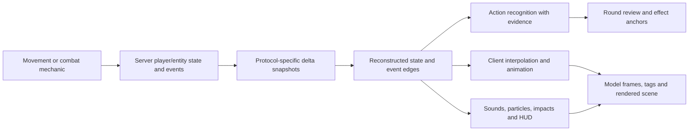

# Quake Live demo: action-to-code reference

**Reference date: 2026-09-07. Sample: DEMO509, protocol 73, overkill, Clan Arena.**

This document connects gameplay actions to engine functions, recorded fields/events, parser
coverage, and the code that produces movement, animation, sound and pixels. It is the entry
point for the detailed chapters below and the template for checking other demos.

The mapping is source-backed. Sample observations are identified separately from source
explanations. It does not claim that every action has been visually demonstrated in this
recording or that the current parser exports everything the engine knows.

## Reconstruction objective

The intended result is to rebuild the full visible action despite POV recording gaps.
See [teleports, visibility and missing-action reconstruction](visibility-teleport-reconstruction.md)
for recovery versus prediction, unseen projectile flights, obituary-only outcomes and teleport discontinuities.

## Read an action through the whole chain



A demo stores changing game state and events. It does not store finished video frames.
A jump event can identify a jump; its position trajectory explains where it happened;
legsAnim selects a body sequence; model assets, interpolation and camera settings determine
how it looks. These are related observations, not interchangeable codes.

## Action index

Each chapter contains exact local source links, protocol fields, recognition limits and
sample evidence where available.

| Action | Primary evidence / code route | Detailed reference |
|---|---|---|
| Normal jump, forward/backward jump pose | EV_JUMP → PM_CheckJump reference → velocity/ground state → CG_EntityEvent and legs animation | [Movement](movement-code-map.md) |
| Jump pad launch | EV_JUMP_PAD, launch velocity and pad association → smoke/sound and airborne movement | [Movement](movement-code-map.md) |
| Falling, landing, steps | Ground transitions, trajectories, fall/step events; airborne alone does not prove a jump | [Movement](movement-code-map.md) |
| Walk, run, crouch, strafe | pm_flags, movementDir, velocity, legsAnim; exact held keys are not inferred from position | [Movement](movement-code-map.md) |
| Knockback / rocket jump | Damage impulse plus motion evidence; a speed increase alone is insufficient | [Movement](movement-code-map.md), [Damage](damage-code-map.md) |
| Weapon switch and fire | EV_CHANGE_WEAPON / EV_FIRE_WEAPON and WP identity → weapon state, muzzle effects and sound | [Weapons](weapon-code-map.md) |
| Rocket/grenade direct hit and splash | Projectile collision → missile events; radius damage is separate; obituary MOD records lethal cause | [Weapons](weapon-code-map.md) |
| Rail, lightning, bullets and shotgun | Trace/fire/impact paths; visual beam or discharge alone does not prove damage | [Weapons](weapon-code-map.md) |
| Health/armor damage received | Signed health and armor changes; damage feedback fields → view kick / directional screen feedback | [Damage](damage-code-map.md) |
| Hit confirmation and damage dealt | PERS_HITS / generic1 protocol-aware interpretation; exact dealt damage is not established by existing export | [Damage](damage-code-map.md) |
| Pain, death and gib | Separate pain/death/gib effects; EV_OBITUARY identifies killer/victim/cause | [Weapons](weapon-code-map.md), [Damage](damage-code-map.md) |
| Body / weapon animation | legsAnim + torsoAnim + toggle → lerp frames → model/tag attachment → scene submission | [Animation](animation-code-map.md) |
| First-person vs third-person view | Different weapon/model presentation paths and camera timing | [Animation](animation-code-map.md) |
| Teleport and other presentation effects | Discontinuity handling plus event-dependent sound/particles; interpolation may be disabled | [Animation](animation-code-map.md) |
| Round boundaries and multi-kill sequences | Configstring round state plus obituary timestamps, preserving the enclosing round | [Sample timeline](source-of-truth.md) |

## Verified examples from the supplied demo

Sample identities use slot aliases. P02 is the primary recorded POV; this alone does not
establish account ownership. Times are absolute server milliseconds.

| Observation | Evidence | What is established |
|---|---|---|
| Jump pad | E01015 at 60500 ms | Recorded jump-pad event; adjacent motion samples in movement chapter |
| Jump | E01045 at 61300 ms | Recorded jump event; adjacent motion samples in movement chapter |
| Resource loss | 220325 → 220350 ms, P02 | Health 194→160 and armor 85→19: 100 net resource loss; attacker/weapon not established by that pair |
| Round 6 kill 1 | E05568 at 221225 ms | P02→P04, MOD_ROCKET |
| Round 6 kill 2 | E05833 at 243525 ms | P02→P05, MOD_RAILGUN |
| Round 6 kill 3 | E05945 at 249625 ms | P02→P07, MOD_ROCKET_SPLASH |

The three round-six kill outcomes have previous visual spot-checks, described in the sample
timeline and capture evidence. The movement and damage examples above are decoded observations,
not newly frame-validated clips. There is no claim of an exhaustive visual audit of all rounds.

## Provenance and confidence

- Demo SHA-256: `876bb6742ace7189e709d55356534ab206f2a095eea2e33d828c3bc3724e1545`.
- Audited sample: 19,729 snapshots, 14,211 supported event records, 79 obituaries, 15 reconstructed rounds.
- Source links target the local canonical WolfcamQL tree, which identifies as 12.7test49.
  The configured capture runtime is 11.3; source links do not prove binary equivalence.
- Shared/server-side Q3-derived mechanics explain the implementation model. They do not certify
  proprietary historical Quake Live server constants or match settings.
- Raw QL73 event IDs, runtime event enums, WP weapon IDs, MOD death causes and animation IDs
  occupy different number spaces. Never reuse a numeric lookup across them without translation.
- Protocol 73 uses playerStateFieldsQ3 in this client's decoder. Netfield indices identify
  delta fields, not fixed byte positions in a compressed demo.

Use four evidence labels: **recorded** (raw field/event), **derived** (stated calculation),
**source-explained** (a code path), and **visually checked** (a named frame/capture).
One label does not imply the others.

## Current parser coverage and remaining implementation work

The reference is available; these are implementation/evidence limits that must remain visible
when using it to build recognition or scoring:

| Gap | Consequence / required handling |
|---|---|
| Whitelist excludes some bullet, shotgun, bounce, metal-impact and movement events | No exported record does not mean no action. Inventory raw events before expanding recognition. |
| Animation and damage feedback scalar fields are internal but not exported | Retain raw values, including animation toggle bits and feedback counters, for direct per-frame correlation. |
| persistant, ammo and powerup arrays are discarded | Preserve their reconstructed values before claiming counter-based hit/damage analysis. |
| Sanitized snapshot export omits velocity components, ground and flags | Existing position/speed samples cannot certify exact input, landing, crouch or knockback. |
| Signed health and round boundary bugs in native parser | Use audited normalization/boundaries; zero packet errors alone is not semantic validation. |
| POV-only health visibility | Do not construct exact all-player damage totals from a followed player's resources. |
| Source/runtime/assets differ | Record hashes and playback settings before claiming a reproducible code-to-pixel experiment. |

## Contract for applying this reference to another demo

1. Record demo hash, protocol, map, game type, snapshot cadence, parser revision and decoder table.
2. Reconstruct delta state against the correct base; preserve event identity/sequence information.
   Deduplicate event edges without deleting genuinely repeated actions.
3. Preserve raw fields alongside interpreted values. Alias client slots and track client/life changes.
4. For each recognized action, store server time or interval, actor/target when established,
   raw event/field evidence, before/after snapshots, rule name, source anchor and evidence label.
5. Keep received damage, hit confirmation, dealt damage and lethal cause separate.
   Unknown values remain null, not zero. Do not infer missing inputs from appearances.
6. Attach actions to the enclosing round. Multiple kills and high-damage intervals can share one
   review item while retaining separate effect anchors and the full context.
7. Verify selected action timestamps against playback using an explicit server-time/video-time
   relationship. Archive runtime/asset hashes and representative frames before batch use.

A suitable record is:

```json
{
  "action": "jump",
  "actor": "P02",
  "server_time_ms": 61300,
  "evidence_id": "E01045",
  "raw_event_code": 10,
  "evidence_level": "recorded",
  "exact_input": null,
  "visual_check": null
}
```

## Companion material

- [Audited sample timeline and limitations](source-of-truth.md)
- [Sanitized event/snapshot evidence](evidence.json)
- [Visual action-chain overview](action-map.html)
- [Interactive sample explorer](explorer.html)
- [Capture/effects command reference](../2026-09-06-capture-effects-command-reference.md)

CFG effects and animation controls operate on presentation; they do not replace gameplay
recognition. Use recognized event times as editing anchors, then apply the separately verified
commands for the actual capture engine/version.
