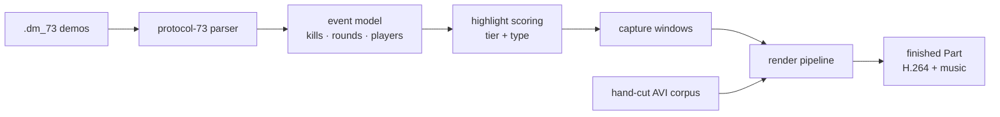
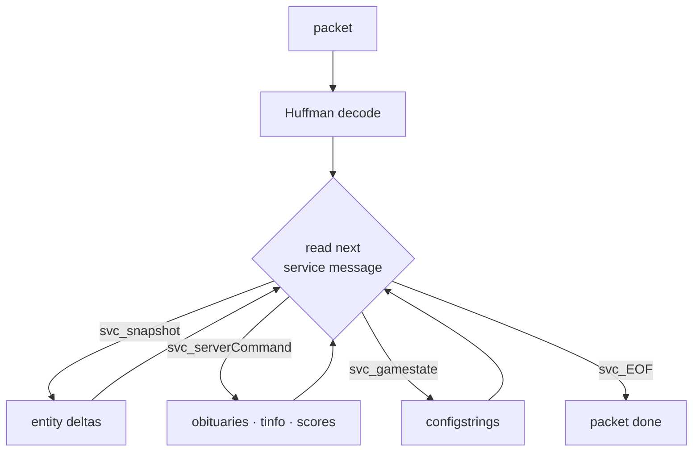
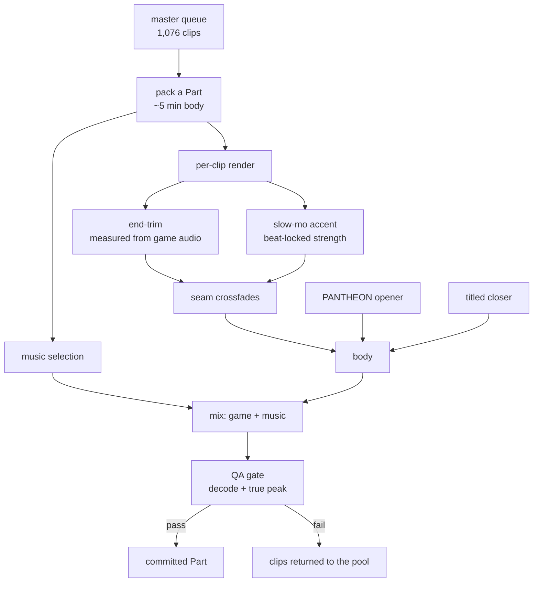

# QUAKE LEGACY — how it works

A technical companion to the launch kit. Written for people who want to know
what the tool actually does before they trust it with their own demos, and for
anyone deciding whether it is worth building on.

Everything here describes behaviour that exists and is covered by the test
suite (1,095 tests). Where something is unproven it says so.

---

## 1. The short version

Quake Live demos are not video. A `.dm_73` file is a recording of the network
traffic between client and server: Huffman-compressed packets carrying
snapshots and entity deltas. To find the interesting moments you have to decode
the protocol.

QUAKE LEGACY decodes it, works out what happened, decides which moments are
worth watching, and cuts the video.



Two things feed the renderer: the demo corpus (the real path) and a decade of
clips cut by hand years ago (the archive path, which is what produced the
current 54-Part series). Both end in the same pipeline.

---

## 2. What distinguishes it from Wolfcam

This is the first question anyone familiar with the scene asks, and the honest
answer is that **they are not the same kind of tool**.

**WolfcamQL is a demo player.** It is an excellent one — a modified Quake 3
client that plays back `.dm_73`, gives you free camera control, chase cams,
timescale, and an AVI capture command. It is how Quake movies have been made
for years, and this project uses it for capture.

What it does not do is *decide anything*. You watch the demo, you find the
frag, you note the timestamp, you set up the camera, you capture, you cut. A
decade of demos means a decade of watching.

**QUAKE LEGACY reads the demo instead of playing it**, and the difference is
what that makes possible:

| | WolfcamQL | QUAKE LEGACY |
|---|---|---|
| Reads `.dm_73` | Yes — to render it | Yes — to *analyse* it, no engine required |
| Tells you where the frags are | No | Yes — every kill, with attacker, victim, weapon, server time |
| Knows which player is *you* | You pick | Derived from the playerstate stream, so nickname changes don't matter |
| Ranks moments | No | By weapon, air time, multi-kill, clutch, combo |
| Cuts and scores video | Manual | Automated, with audio safety gates |
| Runs unattended | No (GUI) | Yes — 54 Parts overnight |
| Corpus scale | One demo at a time | 4,292 demos, 214,184 kills |

The two are complementary. The parser finds the moment and computes the capture
window; WolfcamQL is then driven to record it. Nothing here replaces Wolfcam's
renderer — it replaces the human who was watching everything to find the
timestamps.

**Compared to UberDemoTools / QLDT:** those are real, good, and have existed for
years. UDT in particular parses demos and cuts them. The distinction is scope:
UDT gives you a demo-processing toolkit, this is an end-to-end pipeline that
ends in a finished, music-scored, loudness-compliant video. The parser was
written from scratch because being certain what every bit meant was the point —
and because the format work is meant to be published, not just used.

---

## 3. The parser



The one detail worth knowing, because it cost the most: **a packet contains
several service messages, terminated by `svc_EOF`.** An early version of the
dispatcher read the first message and moved to the next packet. Any snapshot
that happened to sit behind a `serverCommand` in the same packet was silently
discarded — which is exactly what happens during a busy round, because that is
when the server bundles messages together.

There was no exception and no warning. The parser returned 0–3 kills per demo
and every one of those numbers looked plausible. Reading each packet through to
`svc_EOF` turned the same demos into 103–296 kills each.

Results across the corpus:

- 6,445 demo files → **4,292 unique** (2,153 were byte-identical duplicates)
- 4,292 parsed, **0 failures, 0 packet errors**
- **214,184 kills**, of which **34,987** belong to the recording player
- **1,746 clutch rounds** — last player alive, round still won
- the previous database held **222**

A second decoding defect is worth repeating for anyone writing their own parser:
the snapshot's `areamask` length field is followed by `areamaskLen + 1` bytes,
not `areamaskLen`. Reading the documented length desynchronises the stream and
silently drops roughly three quarters of every demo.

### Verification

A large number is easy to produce and worthless unless it is checked against
something that did not produce it.

2012-era demos carry a `tinfo` servercommand containing teammate health. A
teammate's health crossing >0 → 0 is an independent death signal, decoded by a
completely separate code path. On the reference demo: **47 death signals, 47
matched to a decoded kill for the same victim, 0 unmatched.**

2010–2011 demos do not emit `tinfo` at all — confirmed by a command census
rather than assumed. An earlier claim that the `scores` command gave full recall
for that era **was withdrawn after measurement**: the score field moves for
several players at once in every observed update, making it a round-result
signal rather than an individual death oracle. That era is certified as
"decodes coherently" and explicitly **not** independently verified.

Certification detail: `docs/reference/parser-certification-2026-08-30.md`.

---

## 4. The render pipeline



### Trimming is measured, not assumed

Hand-cut clips usually stop a beat late: the frag lands and the recording keeps
rolling into the respawn or the console. The pipeline measures that tail instead
of guessing at it — it template-matches the game's own sounds (rail, lightning,
rocket, plasma, jump, weapon change, hit feedback) extracted from `pak00.pk3`,
finds the **last** one, and treats everything past a fixed aftermath hold as
dead.

Across 1,419 clips: median dead tail **1.38 s**, p95 **3.20 s**, and **323 clips
(23%)** carry enough to be worth cutting. Nothing is ever trimmed from the start
— a clip that starts late has lost a frag, and that is unrecoverable.

### Music is chosen by measured coincidence

There is no target BPM. Every track in the curated library (396 songs, tempo
band 95–140) is scored by **what fraction of this Part's actual game events land
within 120 ms of one of that track's beats**, and the best-scoring track wins.
Playback speed is never altered, so pitch is untouched.

Length is a *selection constraint*, not something the mixer discovers late: a
video gets one song if one covers it, two if it needs two, every song plays for
a musically meaningful run, and no song is cut down to a fragment of itself.
When two are used they are matched in tempo so the crossfade is a blend.

### Slow-motion strength is solved, not assumed

A slow-motion accent is the only elastic part of a shot, so rather than picking
a fixed rate and landing wherever that happens to land, the pipeline picks the
musical moment the shot should **end** on — a drop, then a downbeat, then any
beat — and solves for the strength that gets there:

```
out(rate) = (a − w0) + (b − a) / rate + (w1 − b)
```

The rate is constrained to a band that still reads as slow motion (0.30×–0.62×).
If no landing is reachable inside that band, the default rate is kept rather
than distorting the shot to chase the grid.

This is applied **only to shots that already had an accent, and only to short
single-frag clips** (14% of the corpus, ~2–3 per Part). Tuning every shot would
turn the video into a yo-yo; the point is consistency, not effect density.

Verified against a real render: predicted 8.596 s, produced 8.584 s — inside one
frame at 60 fps.

### Audio safety is a gate, not a hope

Every finished Part is measured after encoding. The ceiling is **−1.0 dBTP true
peak** at **−14 LUFS**, and true peak is kept strictly distinct from sample peak
throughout — a sample limiter cannot bound a reconstructed inter-sample peak, so
limiting runs at 4× the sample rate.

A single open-loop correction is not enough: AAC→AAC re-encoding gives back
roughly 0.2–0.3 dB, so the correction iterates and re-measures, up to three
passes.

### Nothing is consumed until it is proven

Clips are claimed by full path, and a Part is only committed after its video
passes a full decode check and the true-peak check. If QA fails, the clips
return to the pool and the Part is rebuilt. That invariant is what makes an
overnight run safe to leave alone: the failure mode is a retry, never a silently
missing frag.

The supervisor detects a **stalled but alive** renderer — the failure that looks
healthy to every naive check — by watching for log silence, and recovers by
killing the tree and relaunching from committed manifests.

---

## 5. Repository map

```
creative_suite/            the application (FastAPI, port 8765)
  engine/                  render pipeline
    render_highlight.py      per-Part assembly, mixing, QA
    tail_trim.py             measured end-trim from game audio
    game_beat.py             game-event template matching
    music_beatmatch.py       action-match song selection + planning
    effects/speed_ramp.py    speed plans, beat-locked slow-mo
    sound_templates/         pak00 reference sounds
  api/  frontend/          studio UI
  comfy/                   texture work (separate track)
engine/
  parser/                  C++17 dm73 parser
  engines/                 engine source trees, RE output
docs/
  reference/               format findings, certification
hl_series.py               series orchestrator
```

---

## 6. Using it

> The public CLI (`pip install quake-legacy`) is the goal, not yet the state.
> Today this runs from the repository.

**Inspect what was found** — the studio UI at `http://localhost:8765/studio`
lists frags with filters by weapon, tier and type.

```bash
uvicorn creative_suite.app:create_app --factory --host 0.0.0.0 --port 8765
```

**Render a series** — the orchestrator packs the queue into Parts, picks music,
renders, runs QA, and commits. It is resumable: interrupt it and it continues
from the last committed Part.

```bash
python -u hl_series.py
```

Run directories are configurable (`QL_SERIES_DIR`, `QL_WORK_DIR`,
`QL_MANIFEST_DIR`, `QL_LOCK`, `QL_STEMS_DIR`) so a regeneration never touches a
finished series.

**Offline / CI** — `CS_REBUILD_MOCK=1`, `CS_PREVIEW_MOCK=1` and
`CS_ENGINE_MOCK=1` let the suite run with no engine binary, no Wolfcam and no
ffmpeg.

---

## 7. What is not done

Stated plainly, because a project page that only lists wins is not useful.

- **2010–2011 demo verification.** Decodes coherently; no independent
  cross-check exists for that era. Flagged, not hidden.
- **A/V sync drift.** A measured −118 to −217 ms offset between game audio and
  picture on some sources is diagnosed but not yet fixed.
- **Cutting straight from demos.** The current series is built from clips cut by
  hand years ago. Driving capture directly from parser output is the next
  milestone.
- **Camera work from demo data.** Rocket-follow and bullet-cam need the capture
  path first.
- **The public CLI.** Not packaged yet.

---

## 8. Format notes for other implementers

The findings are documented as they are made, in `docs/reference/`. The two that
will cost you the most time if you do not know them:

1. **Read every packet through to `svc_EOF`.** One packet, several messages.
   Stopping at the first one loses snapshots in exactly the busy rounds you care
   about, with no error.
2. **`areamask` is `areamaskLen + 1` bytes.** Reading the documented length
   desynchronises the stream silently.

The Q3 engine was given away. This is a piece back.
